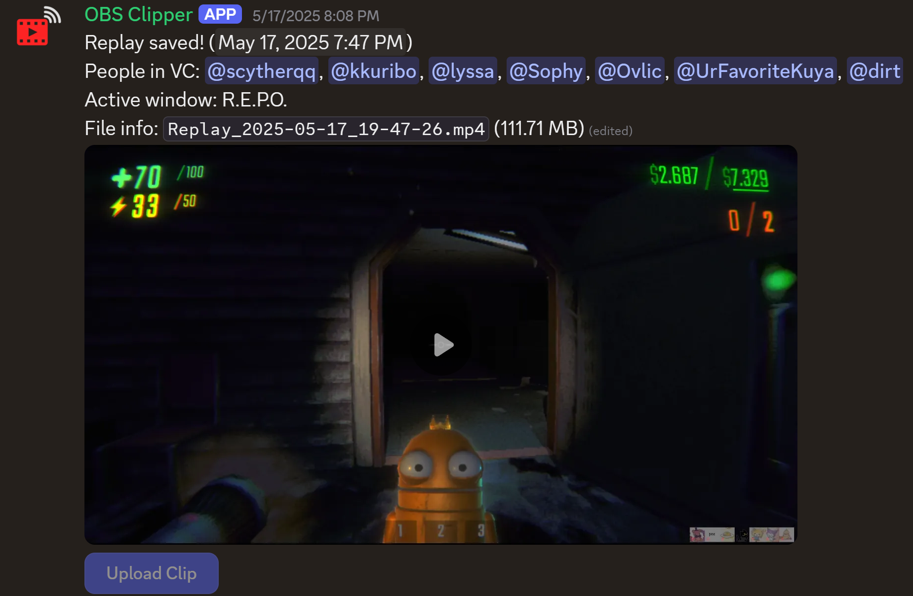

# OBSClipper – Discord Voice Chat Clip Bot with OBS Integration

OBSClipper is a Discord bot that listens for voice chat activity, interfaces with OBS to detect replay buffer saves, and sends clip messages to Discord.
<br><br>
---

## Features

* **Voice Channel Tracking**
  Monitors when a specific user joins/leaves a VC, along with all participants.

* **OBS Replay Buffer Listener**
  Automatically triggers on saved replay buffer events by playing a sound effect and sending a notification.

* **Smart Clip Sharing**
  Sends clip message with "Upload Clip" button.

* **Contextual Messaging**
  Saves who was in the VC, what app was active, and when the clip was made.

* **Configurable**
  Has many settings, including playing a sound effect when a clip is captured and optional `.mkv` to `.mp4` conversion.

---

## Installation

### 1. Clone the Repository

```bash
git clone https://github.com/Ovlic/OBSClipper.git
cd OBSClipper
```

### 2. Install Dependencies

```bash
pip install -r requirements.txt
```

Required libraries include:

* `discord.py`
* `obsws-python`
* `simpleaudio` (macOS/Linux) or `pywin32` (Windows)
---

## Configuration

Configuration is handled through a `Config` object (`config.py`). Update the call to the class with your information.

---

## Running the Bot

```bash
python main.py
```

---

## 💬 Slash Commands

| Command             | Description                                     |
| ------------------- | ----------------------------------------------- |
| `/upload_file`      | Sends a test `.mp4` file.                       |
| `/get_vc_users`     | Lists users currently in VC with the main user. |
| `/search_for_user`  | Searches for the main user across VCs.          |
| `/kill_obs`         | Force-disconnects from OBS.                     |

---

## How It Works

1. When the main user joins a VC, recording starts.
2. When OBS saves a replay buffer, the bot is notified.
3. A contextual message is sent to a Discord channel:<br>
4. That message includes a **"Upload Clip"** button, usable only by the initiating user.
5. Clicking the button sends the actual clip file:<br>

**Note that the bot must be running on the device that is storing the clips.**

---

## FAQ

### **Why doesn't the bot upload the clip immediately after it's saved?**

Uploading large media files directly when a replay is saved can be limiting and disruptive, plus Discord imposes stricter file size limits when sending files through standard messages (`ctx`). However, when clips are shared via an interaction (such as pressing a button), Discord allows significantly larger uploads.

---

## Todo
* Simplify audio packages into one package for all platforms.
* Add a database that stores clip filepaths and discord CDN URLs.
* Add a command to list all clips and their file sizes.
* Update the original message after the clip is uploaded to include a link to the clip.
* (POTENTIAL!) Add a command to delete clips from the database and the filesystem.
* Add a command to search for clips by user, date, or other criteria.
